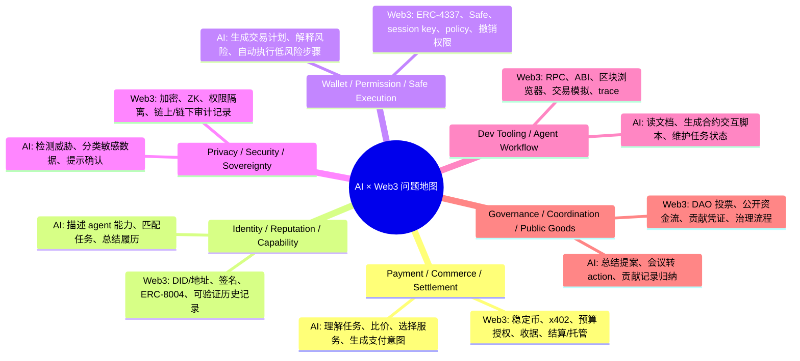

# Week 2｜AI × Web3 问题地图与主方向选择

Date: 2026-05-25
WCB task: Week 2｜方向研究｜AI × Web3 问题地图与主方向选择
Handbook pages:
- https://aiweb3.school/zh/handbook/bridge/chain-aware-context/
- https://aiweb3.school/zh/handbook/bridge/web3-tool-use/
- https://aiweb3.school/zh/handbook/bridge/agent-workflow/
- https://aiweb3.school/zh/handbook/bridge/agent-wallet/
- https://aiweb3.school/zh/handbook/bridge/machine-payment/

## 1. 今天的学习目标

Week 1 我已经补了 AI / Web3 的基础词汇。今天开始进入 Week 2：不再只问“AI 是什么、钱包是什么”，而是把 AI × Web3 拆成几个真实问题方向，判断哪些问题必须同时需要 AI 和 Web3，最后选出一个本周主线。

我的时间预算仍然按每天 1 小时来做，所以今天的产出重点是：

1. 画一张问题地图，至少覆盖 5 个方向。
2. 每个方向说明 AI 的作用和 Web3 的机制。
3. 选择 2 个方向解释：为什么它不是纯 AI，也不是纯 Web3。
4. 最后选 1 个方向作为 Week 2 主线。

## 2. AI × Web3 问题地图

## 3. 方向拆解

### A. Payment / Commerce / Settlement

问题：如果一个 agent 要帮用户完成任务，并调用另一个付费 API / agent / 人工服务，谁报价、谁授权、谁付款、谁验收？

AI 的作用：
- 把用户目标拆成任务。
- 对不同服务报价做比较。
- 判断服务结果是否满足交付标准。
- 在预算内选择下一步调用。

Web3 的机制：
- 用 stablecoin 或链上支付完成结算。
- 用 x402 / HTTP 402 一类协议表达“先付款再访问服务”。
- 用 escrow / receipt / transaction hash 证明付款与交付。
- 用 wallet policy 限制单次金额、总预算、服务方范围和时间窗口。

### B. Identity / Reputation / Capability

问题：如果网络里有很多 agent，用户如何知道某个 agent 真的会做某类任务？另一个 agent 又如何安全地调用它？

AI 的作用：
- 生成和更新 agent profile：能做什么、输入输出是什么、限制是什么。
- 根据用户目标匹配合适 agent。
- 总结历史任务记录和失败原因。

Web3 的机制：
- 用地址、签名或 DID 作为 agent 身份锚点。
- 用 ERC-8004 这类 agent identity registry 记录身份、能力或服务端点。
- 用可验证的任务记录、付款记录、评价记录形成 reputation。

### C. Wallet / Permission / Safe Execution

问题：Agent 能不能代表用户发起链上动作？如果可以，边界在哪里？

AI 的作用：
- 理解用户意图，生成交易计划。
- 解释每一步资产变化、授权变化和风险。
- 自动执行只读查询、草稿生成、低风险白名单动作。

Web3 的机制：
- ERC-4337 / Smart Account 表达更细的账户规则。
- Safe / 多签用于高价值资产和团队 treasury。
- Session key / policy 用于小额、短时、可撤销授权。
- 区块浏览器、交易哈希、事件日志用于验证执行结果。

### D. Privacy / Security / Sovereignty

问题：Agent 需要上下文才能工作，但上下文可能包含钱包、交易习惯、财务数据、身份信息和私有策略。怎样避免 agent 因为 prompt injection、工具误用或数据泄露伤害用户？

AI 的作用：
- 识别敏感数据和异常指令。
- 为高风险动作触发人工确认。
- 对工具返回做一致性检查。

Web3 的机制：
- 用最小权限账户隔离风险。
- 用链上/链下日志保存可审计记录。
- 用 ZK / 加密 / 本地执行减少不必要的数据暴露。

### E. Dev Tooling / Agent Workflow

问题：开发者怎样让 agent 安全地读链、读合约、生成交易草稿、跑测试、解释区块浏览器结果？

AI 的作用：
- 阅读 ABI、文档、合约源码和错误日志。
- 生成调用脚本、测试用例和解释文档。
- 把“目标 → 上下文读取 → 计划 → 工具调用 → 风险检查 → 执行 → 复盘”组织成 workflow。

Web3 的机制：
- RPC / indexer / explorer 提供链上事实。
- ABI / event / tx receipt 提供结构化接口和结果。
- Simulation / fork test 降低真实执行前的风险。
- Trace 记录每次工具调用的来源、参数和结果。

### F. Governance / Coordination / Public Goods

问题：DAO 和开源社区有大量讨论、提案、会议和贡献记录，AI 可以提高效率，但不能替代治理确认。

AI 的作用：
- 总结提案和会议。
- 把讨论变成 action items。
- 帮助整理贡献记录和预算说明。

Web3 的机制：
- 投票、multisig、公开资金流和链上记录提供最终确认。
- 贡献凭证和公开 repo 让贡献可追溯。
- 治理流程限制 AI 自动执行预算或改规则。

## 4. 两个方向的“非纯 AI / 非纯 Web3”判断

### 方向 1：Wallet / Permission / Safe Execution

为什么它不是纯 AI 问题：
- 纯 AI 可以生成交易说明，但不能真正保证资产安全。
- 风险边界必须落实到账户、钱包、policy、session key、multisig 或智能账户规则里。
- 如果只靠 prompt 说“不要转太多钱”，模型可能被上下文诱导或工具返回误导。

为什么它不是纯 Web3 问题：
- 传统钱包可以签名和转账，但不会理解用户的自然语言目标。
- 用户需要 AI 把复杂操作解释成人能看懂的计划和风险摘要。
- Agent workflow 还需要模型处理文档、错误、上下文和任务拆解。

结论：这个方向的核心是“AI 负责理解和规划，Web3 负责约束和验证”。

### 方向 2：Payment / Commerce / Settlement

为什么它不是纯 AI 问题：
- AI 可以比价和选择服务，但付款、结算、收据、退款和争议需要可验证机制。
- 商业闭环不能停在“我建议你付钱”，必须能证明谁付给谁、为什么付、交付了什么。

为什么它不是纯 Web3 问题：
- 链上支付本身只解决 value transfer，不解决任务理解、服务选择和结果验收。
- Agent commerce 需要 AI 判断“这个服务是否适合当前任务”“交付是否达标”“是否继续调用”。

结论：这个方向的核心是“AI 负责服务发现和任务验收，Web3 负责授权、结算和凭证”。

## 5. Week 2 主线选择

我选择的 Week 2 主线：Payment / Commerce / Settlement，也就是“Agent 如何在可授权、可验证、可追踪的边界内完成报价、付款、交付、验收和结算”。

选择原因：
1. 它更接近 “Open Agentic Economy” 的核心问题：如果 agent 之间要协作，必须有清晰的报价、授权、付款、交付和收据。
2. 它不是单纯的链上转账，而是把 AI 的任务理解、服务发现和结果验收，与 Web3 的稳定币、x402、预算控制、receipt、escrow 结合起来。
3. 它可以形成一个小而清晰的 Hackathon 方向：做一个 agent commerce flow，让用户授权一笔小预算，agent 在预算内购买一个服务，并留下可审计记录。
4. 它能继续连接 Week 2 后续任务：最小支付与商业流程拆解、x402 Paywall + CAW Agent 自主支付闭环、Agent Profile、Threat Model、Proposal。

## 6. 初步 MVP 想法

暂定项目名：Agent Service Payment Copilot

一句话：一个面向 agent 服务购买的小型支付助手，帮助用户把“我想让 agent 帮我完成某个任务”转成报价、预算授权、执行、交付、验收、付款/退款和记录证明的完整流程。

最小功能：
- 用户输入目标：例如“我想让 agent 花不超过 1 USDC 调用一个付费数据 API，并把结果整理成摘要”。
- Agent 输出：
  - 任务范围：用户要买什么服务，交付物是什么。
  - 报价信息：价格、币种、有效期、服务方、退款/失败条件。
  - 预算授权：任务预算、单次上限、服务方白名单、时间窗口。
  - 执行流程：请求服务、识别 payment required、发起付款、获得结果。
  - 验收方式：结果是否满足任务要求，是否需要人工确认。
  - 记录证明：付款 tx hash、receipt、服务响应、交付摘要。
- 系统边界：
  - 不接触私钥、助记词、API key。
  - 不提供无限支付权限；所有付款都必须落在用户预设预算和服务方范围内。
  - approve、提高额度、未知收款方、大额付款、重复扣款都必须人工确认。

## 7. 今天的下一步

下一步我会围绕主线继续做两个产出：

1. 最小 payment / commerce flow：谁下单、谁执行、谁验收、谁付款、谁仲裁。
2. x402 / CAW / budget policy 草图：报价、预算、授权、付款、receipt、失败和退款如何串起来。
