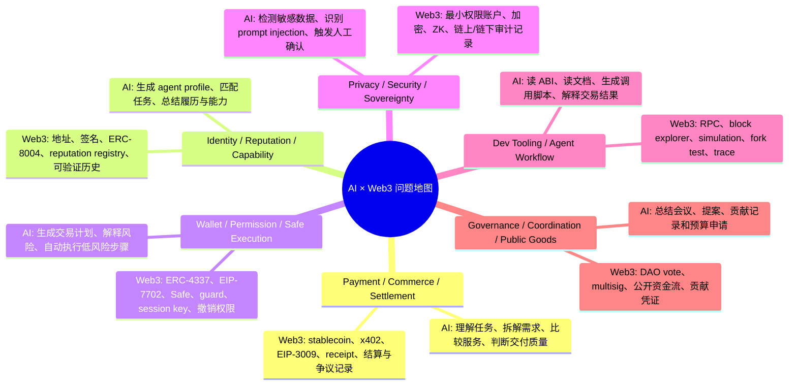
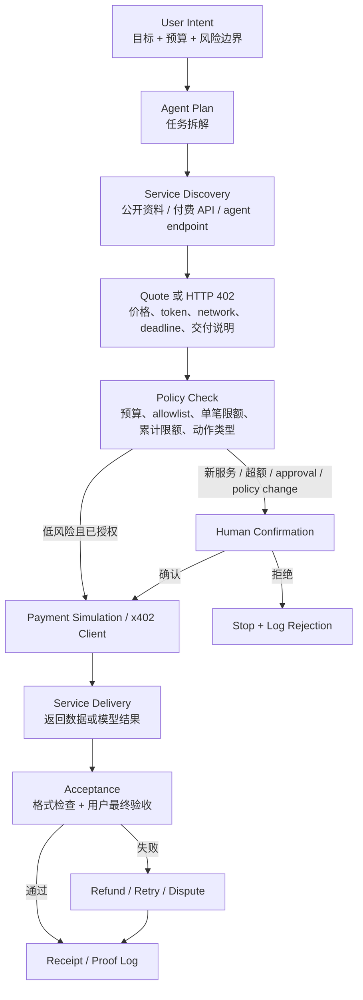

# Week 2｜总交付｜方向深挖包与项目初步 Proposal

日期：2026-05-29
WCB 任务：Week 2｜总交付｜方向深挖包与项目初步 Proposal
状态：Proof-of-Work 草稿

## 0. 一句话总结

我本周选择的 AI × Web3 主方向是：Payment / Commerce / Settlement。

我想探索的问题是：当 AI agent 帮用户完成任务、调用服务、甚至购买小额 API / 数据 / 模型能力时，如何把“自然语言目标”转换成可授权、可限制、可验证、可追责的商业闭环。

最终收敛成一个项目初步 proposal：

> Agent Commerce Sandbox：一个模拟 x402 paywall + wallet policy + receipt log 的最小验证环境，让用户看到 agent 从 intent、quote、policy check、human confirmation、payment simulation、delivery 到 proof log 的完整流程。

这个 proposal 暂时不接真实资金，也不接触私钥；先验证产品逻辑、安全边界和 proof-of-work 记录方式。

---

## 1. AI × Web3 问题地图



这张地图里，所有方向都不是“AI 加一个钱包”这么简单。真正的交叉点在于：AI 负责理解、判断、协调和生成计划；Web3 负责授权、执行、验证、记录和资产边界。

---

## 2. 主方向选择说明

### 2.1 选择方向

我选择：Payment / Commerce / Settlement。

更具体地说，是 agent commerce：agent 如何在用户授权边界内购买服务、完成交付、验收结果、触发付款或争议，并留下 proof log。

### 2.2 为什么它不是纯 AI 问题

纯 AI 可以做：

- 理解用户目标。
- 拆解任务。
- 搜索和比较服务。
- 判断返回结果是否相关。
- 生成付款建议和总结报告。

但纯 AI 不能可靠解决：

- 钱从哪里来，付给谁，金额是多少。
- 用户是否真的授权这笔付款。
- 付款是否可验证。
- 服务交付失败时如何退款、争议或追责。
- agent 是否被 prompt injection 诱导去向错误对象付款。

如果只让模型说“我会控制预算”，这不是安全边界，只是一句提示词。真正的预算、allowlist、收款方、token、deadline、nonce 和撤销机制必须落实到账户、policy 或支付协议层。

### 2.3 为什么它不是纯 Web3 问题

纯 Web3 可以做：

- 转账和结算。
- 用 stablecoin 表达金额。
- 用 x402 / EIP-3009 表达付款请求和签名授权。
- 用 tx hash、receipt、event log 证明动作发生过。
- 用 smart account、Safe、guard 限制权限。

但纯 Web3 不会自动理解：

- 用户到底想完成什么任务。
- 哪个服务适合这个任务。
- 交付结果是否满足需求。
- 哪些失败应该重试，哪些应该进入 dispute。
- 如何把复杂的链上结果解释成人能复核的决策摘要。

所以这个方向的核心不是“链上支付”，而是：AI 负责商业意图和服务判断，Web3 负责授权边界、付款执行和可验证记录。

---

## 3. 主方向深挖包

### 3.1 典型场景

场景：付费研究资料助手。

用户输入：

> “帮我研究 x402、ERC-8004、agent wallet 是否适合作为 Hackathon 项目方向。可以购买小额付费 API 或 agent 服务，但总预算不超过 5 USDC。任何新服务首次付款必须让我确认。”

参与方：

| 参与方 | 角色 | 责任 |
| --- | --- | --- |
| 用户 / Buyer | 下单方、预算提供方、最终验收方 | 描述目标、设置预算、确认高风险动作、验收最终结果 |
| Research Agent | 执行方 | 拆解任务、发现服务、比较报价、整理交付物 |
| Paid Service / Agent Endpoint | 服务方 | 给出报价、提供数据或模型结果、声明退款条件 |
| Agent Wallet / Smart Account | 付款执行层 | 在 policy 允许范围内付款、保存 receipt |
| Policy / Guard | 安全边界 | 检查预算、allowlist、token、金额、deadline、人工确认条件 |
| Proof Log | 审计记录 | 保存 quote、decision、receipt、delivery summary、failure reason |

### 3.2 最小流程图



### 3.3 AI 作用、Web3 机制、自动化边界

| 环节 | AI 的作用 | Web3 / 协议机制 | 自动化边界 |
| --- | --- | --- | --- |
| Intent | 把自然语言目标整理成任务范围 | 暂无链上动作 | 可以自动化，但目标模糊时要追问 |
| Budget | 建议预算结构和阈值 | wallet policy、session budget | 必须用户确认 |
| Discovery | 查找服务和资料源 | ERC-8004 / endpoint / reputation 可作为发现层 | 可以自动化，但不能自动信任 |
| Quote | 比较报价和交付条件 | x402 的 402 Payment Required 可表达付款要求 | 可以自动化读取；接受报价要过 policy |
| Policy Check | 解释风险、生成决策摘要 | smart account、Safe guard、allowlist、limit | 规则检查可自动化，规则变更必须人工确认 |
| Payment | 发起或模拟付款 | x402、EIP-3009、stablecoin、receipt | 只有 allowlist + 小额 + 预算内可自动化 |
| Delivery | 检查返回格式和来源 | response metadata / proof log | 格式检查可自动化，主观质量需人工验收 |
| Dispute | 总结失败证据和下一步 | receipt、退款规则、争议记录 | 高价值争议需人工处理 |

### 3.4 关键风险

1. 超预算：agent 连续调用服务，累计金额超过用户预期。
2. 错误收款方：服务 endpoint 或付款地址被替换。
3. Prompt injection：网页或工具返回诱导 agent 忽略预算或 allowlist。
4. 伪造报价：工具返回虚假的价格、network、token 或 deadline。
5. 交付不等于付款：付款成功但服务结果低质或无结果。
6. 确认疲劳：所有动作都弹窗确认，用户最后盲点确认。
7. 隐私泄露：agent 把用户目标、钱包、交易习惯或 API key 发送给外部服务。
8. 不可逆授权：approval、delegation、module install 等动作风险远高于一次小额付款。

### 3.5 反例：看起来像 agent commerce，但我暂时不选

反例：让 agent 直接拿一个热钱包私钥，自动搜索服务、自动付款、自动处理退款。

为什么不选：

- 私钥和完整钱包控制权不应该交给 agent。
- 付款和 approval 是不可逆高风险动作。
- 没有 policy、allowlist、单笔限额和 proof log 时，用户无法判断钱为什么被花掉。
- 一旦 prompt injection 或工具返回被污染，损失可能直接发生在资产层。

这个反例说明：agent commerce 的关键不是“让 agent 自己花钱”，而是“让 agent 在明确授权、最小权限、可撤销、可审计的边界内完成商业动作”。

---

## 4. 项目初步 Proposal

### 4.1 项目名

Agent Commerce Sandbox

### 4.2 目标用户

第一批用户不是普通消费者，而是：

- 正在学习 AI × Web3 的 builder。
- 想理解 x402 / agent wallet / ERC-8004 的开发者。
- 想做 agent commerce demo 但不想一开始接真实资金的 Hackathon 参与者。
- 需要向别人解释“agent 支付为什么需要 policy 和 proof”的课程学习者或产品同学。

### 4.3 真实场景

用户想让 agent 帮忙完成一个小任务，例如：

- 购买一个付费 API 的单次结果。
- 调用一个付费 agent endpoint。
- 购买一份小额数据分析。
- 为研究任务获取一次模型推理或检索增强结果。

但用户担心：

- agent 会不会乱花钱。
- 服务方是否可信。
- 付款后有没有证据。
- 如果服务失败怎么办。
- 哪些动作需要自己确认。

### 4.4 最小功能

MVP 不接真实资金，先做模拟版：

1. 用户输入任务目标和预算。
2. 系统生成 2–3 个 mock service quote。
3. Agent 选择一个候选服务，并解释理由。
4. Policy engine 检查：
   - 是否在 allowlist。
   - 单笔金额是否低于阈值。
   - 累计预算是否足够。
   - token / network 是否允许。
   - 是否涉及 approval、delegation、module install 等高风险动作。
5. 如果需要人工确认，展示确认摘要。
6. 模拟 x402 payment required → payment authorization → service delivery。
7. 生成 proof log：quote、policy decision、human confirmation、payment receipt、delivery summary。
8. 用户可以导出 markdown / JSON proof，作为课程提交或项目说明材料。

### 4.5 非目标

MVP 阶段不做：

- 不保管私钥。
- 不连接真实主网资金。
- 不自动执行 approval 或无限授权。
- 不承诺自动退款或仲裁。
- 不把 reputation 设计成完整协议。
- 不把 agent 的质量判断完全自动化。

### 4.6 验证方式

我希望用三个层次验证：

| 层次 | 验证问题 | 通过标准 |
| --- | --- | --- |
| 产品逻辑 | 用户能否理解 intent → quote → policy → receipt | 用户能说清为什么付款、付给谁、拿到什么 |
| 安全边界 | 高风险动作是否被拦截 | 未知服务、超预算、approval、prompt injection 都触发人工确认或拒绝 |
| 技术可行性 | 未来能否替换成真实协议 | mock x402、mock receipt、mock policy 的接口边界清晰 |

### 4.7 Week 3 下一步

Week 3 可以把 proposal 变成一个很小的 demo：

1. 先做 CLI 或网页原型。
2. 写一个 `services.json` mock 服务列表。
3. 写一个 `policy.json`，包含 budget、allowlist、single payment limit、allowed token、allowed network。
4. 写一个模拟 402 的本地 endpoint 或静态流程。
5. 让 agent 读取 quote，跑 policy check，生成 decision。
6. 输出 `receipt.json` 和 `proof.md`。
7. 加入 2–3 个攻击用例：超预算、未知服务、prompt injection。
8. 如果 demo 清晰，再研究真实 x402 SDK、EIP-3009 USDC 授权或 CAW / smart account integration。

---

## 5. 参考资料清单

| 资料 | 我用它判断什么 |
| --- | --- |
| AI Web3 School Week 2 Handbook / Module B | 课程要求我从问题地图收敛到 payment / commerce flow 和 proposal |
| x402 / HTTP 402 payment pattern | 判断付费 API / agent endpoint 如何表达“先付款再访问”的流程 |
| EIP-3009 / transferWithAuthorization | 理解签名授权为什么适合小额 machine payment，而不是每次都让用户自己发交易 |
| ERC-8004 agent identity / reputation | 判断服务发现和 reputation 可以放在哪里，但它不替代用户判断 |
| ERC-4337 / Smart Account | 理解为什么 agent wallet 需要比 EOA 更细的权限规则 |
| EIP-7702 / Smart EOA | 理解普通 EOA 也可能获得智能账户能力，但 delegation 不是无风险动作 |
| Safe / multisig / guard / policy | 判断高价值资产和团队 treasury 为什么不能交给单一热钱包或 prompt 约束 |
| Ethereum “Nothing is automatic” mental model | 提醒自己链上状态不会自动变化，所有执行都需要 caller、gas 和激励设计 |

---

## 6. 没有选择的方向 backlog

### 6.1 Identity / Reputation / Capability

暂时不选的原因：

- 它很重要，但如果没有具体交易或协作场景，profile 和 reputation 容易变成静态名片。
- 我更想先从 payment 场景倒推：什么时候需要 identity，什么时候需要 reputation。
- 后续可以把 ERC-8004 放进 Agent Commerce Sandbox 的 service discovery 模块。

### 6.2 Privacy / Security / Sovereignty

暂时不选的原因：

- 这个方向很大，涉及 ZK、数据最小化、本地模型、密钥管理等多个层次。
- 我当前更适合先做一个小的安全边界：预算、allowlist、人工确认和日志。
- 后续可以把隐私作为 threat model 的一部分：哪些数据不应该发给付费 service。

### 6.3 Governance / Coordination / Public Goods

暂时不选的原因：

- DAO 提案总结和贡献记录是很好的 AI workflow，但支付闭环不如 agent commerce 直接。
- Governance 更依赖真实社区流程和多人协作，我目前一个人做 MVP 会比较难验证。
- 后续可以把 payment / commerce 的 proof log 扩展成公共物资资助或 bounty payout 的证据层。

---

## 7. 最小 Proof Log 草案

```json
{
  "project": "Agent Commerce Sandbox",
  "user_intent": "research x402 and agent wallet for hackathon direction",
  "budget": {
    "session_limit": "5 USDC",
    "single_auto_payment_limit": "0.50 USDC",
    "allowed_token": "USDC",
    "allowed_network": "Base"
  },
  "service_quote": {
    "service_id": "mock-research-agent-01",
    "amount": "0.25 USDC",
    "payment_protocol": "x402-like mock flow",
    "delivery": "source list and comparison summary",
    "expires_at": "2026-05-29T23:59:00Z"
  },
  "policy_decision": {
    "allowed": true,
    "reason": "allowlisted service, below single payment limit, within session budget",
    "human_confirmation_required": false
  },
  "delivery_result": {
    "status": "accepted",
    "summary": "service returned usable research notes"
  },
  "proof": {
    "receipt_id": "mock-receipt-2026-05-29-001",
    "sensitive_data_saved": false
  }
}
```

---

## 8. 当前结论

1. 我选择的主线不是泛泛的“AI agent + Web3”，而是更具体的 agent commerce。
2. 最小闭环应该是：intent → quote → policy → confirmation → payment → delivery → acceptance → proof。
3. x402 解决 payment requirement 和付费访问流程；EIP-3009 解决签名授权式转账；ERC-8004 帮助服务发现和 reputation；wallet policy / guard 才是安全边界。
4. 项目 MVP 应该先模拟，不应该一开始接真实资金。
5. Week 3 最值得做的是一个可以展示失败用例的 sandbox：让审核者看到哪些动作被允许，哪些动作被拒绝，为什么。
