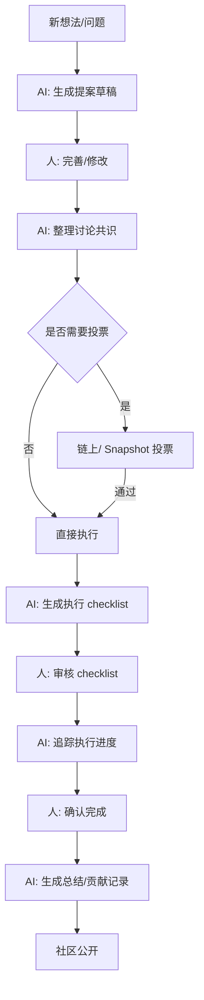

# Week 2｜Governance / Coordination｜治理协作流程草图

日期：2026-05-30
WCB 任务：Week 2｜Governance / Coordination｜治理协作流程草图
状态：Proof-of-Work 草稿（知识扩展）

## 1. 背景

选一个 DAO / 社区流程，拆出 AI 可以辅助的步骤 vs 必须由人/治理流程确认的步骤。

这里我选择 **AI × Web3 School 社区本身**作为分析对象 —— 一个活跃的学习型社区，有提案、活动、贡献记录和公共资源分配。

## 2. 社区治理流程拆解

以"提议一场新的 Co-learning / Workshop"为例：

```
阶段           | AI 可以做什么                       | 必须人做的
---------------|--------------------------------------|--------------------------
1. 想法提出    | 总结类似提案、生成草稿模板               | 提出真实需求
2. 讨论发酵    | 分类、总结讨论串、标出共识/分歧点         | 表达观点、判断价值
3. 提案正式化  | 自动填表单、检查信息完整性、标出风险         | 确定内容方向
4. 时间协调    | 查日历冲突、推荐时间段                    | 确认时间（避开个人安排）
5. 预热推广    | 生成预告文案、翻译、@相关人员             | 审核文案、发布
6. 活动执行    | 自动生成 agenda、记录行动项               | 主持/控场
7. 结果记录    | 自动生成活动总结、感谢名单、贡献记录         | 确认总结准确性
8. 贡献确认    | 自动汇总贡献、计算积分                    | 确认特殊贡献、处理争议
```

## 3. 关键边界

| 场景 | AI 能做 | AI 不能做（必须人决定） |
|------|---------|------------------------|
| 预算/奖励分配 | 整理历史数据、检查公式正确性 | 判断谁更值得激励 |
| 争议处理 | 整理双方观点、列出相关规则 | 做出最终裁决 |
| 活动规划 | 建议主题、时间、格式 | 判断主题是否适合当前社区 |
| 成员评估 | 统计参与度、提交记录 | 评估质量、潜力、信任度 |

## 4. Governance Flow 草图

```
[新想法] → AI 生成草稿 → 讨论 → AI 整理共识/分歧 → 
  → 提案完善 → AI 检查完整性 → 治理投票（链上/Snapshot）→ 
  → 通过 → AI 生成执行 checklist → 人工审核 → 执行 → 
  → AI 自动追踪 → 行动完成 → AI 生成总结 → 社区确认
```



## 5. 一个具体的辅助工具草图：Proposal Summarizer

输入：提案讨论串（Discourse / Telegram / Discord 消息列表）

输出：

```
提案摘要：
- 标题：[自动提取]
- 提议人：[@user]
- 核心内容：3-5 句话
- 预算影响：$XXX（如涉及）
- 共识点：[列表]
- 分歧点：[列表]
- AI 建议：哪些部分已清晰/哪些还需要补充
- ⚠️ 风险标记：截止日期迫近 / 预算未明确 / 缺少反馈
```

AI 标记必须清晰：**🚫 AI 总结，仅供参考** — 每个标注前面都加一个符号，让读者知道这是 agent 生成的，不是权威结论。

## 6. 一句话理解

> Governance 不是"AI 替社区做决定"，而是"AI 帮社区把信息整理好，让人花时间在真正重要的判断上"。治理权力永远不能交给 AI。

## 7. 参考

- Snapshot: offchain 投票
- OpenZeppelin Governor: onchain 执行
- Gitcoin: 公共物品资助机制
- LXDAO / ETHPanda: 社区治理实践参考
